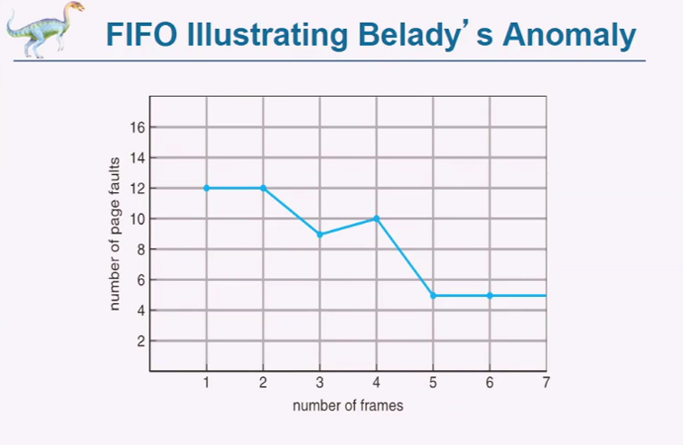
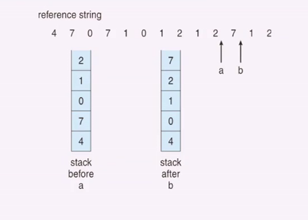
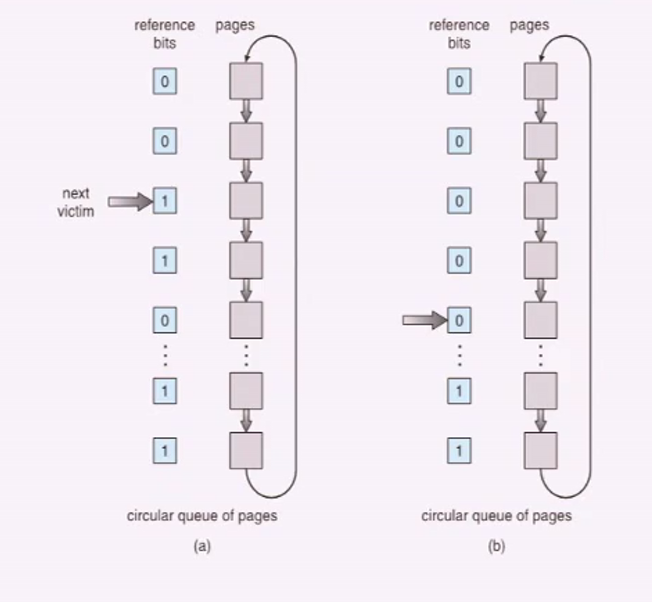

# Virtual Memory

- [Virtual Memory](#virtual-memory)
  - [Paginazione a Richiesta](#paginazione-a-richiesta)
    - [Valid-Invalid bit](#valid-invalid-bit)
    - [Worst Case](#worst-case)
    - [Copy-on-Write](#copy-on-write)
    - [Page Replacement](#page-replacement)
      - [Basic Page Replacement](#basic-page-replacement)
      - [FIFO Algorithm](#fifo-algorithm)
      - [Algoritmo Ottimo](#algoritmo-ottimo)
      - [Least Recently Used LRU](#least-recently-used-lru)
        - [Implementazioni](#implementazioni)
        - [Approxximation Algorithms](#approxximation-algorithms)
      - [Counting Algorithms](#counting-algorithms)
    - [Page-Buffering Algorithms](#page-buffering-algorithms)
    - [Number Of Frames](#number-of-frames)
      - [Allocazione Fissa](#allocazione-fissa)
    - [Thrashing](#thrashing)
    - [Modello Working-Set](#modello-working-set)
      - [Page Fault Frequency](#page-fault-frequency)
  - [Kernel Memory](#kernel-memory)
    - [Buddy System](#buddy-system)
    - [Slab Allocation](#slab-allocation)
  - [Altre considerazioni](#altre-considerazioni)
    - [Prepaging](#prepaging)
    - [Page Size](#page-size)
    - [TLB Reach](#tlb-reach)
    - [Struttura del programma](#struttura-del-programma)
    - [I/O Interlock](#io-interlock)

Il codice deve essere eseguito, ma spesso non serve che tutto il programma risieda in memoria centrale.

E' anche plausibile che certe parti possano servire insieme. Vogliamo misurare quale è la capacità di utilizzare un programma parzialmente memorizzato in RAM.

Cosa significa Virtual Memory? Lo spazio virtuale c'è tutto, ma il fisico è solo di alcune parti. Per questo viene chiamato virtuale e non logico.

Lo spazio di memoria virtuale è la visione logica di come il processo è indirizzato in memoria. Questo è concettualemente contiguo, ma in MMU vengono trasformati in indirizzi fisici. MMU deve effettuare il mapping. Molto spesso è paginazione a richiesta.

Solitamente si vanno a inserire stack negli spazi alti e code, data e heap in basso.

## Paginazione a Richiesta

Carichiamo solo una memoria quando viene richiesta:

- Meno I/O
- Meno memoria necessaria
- Risposta più veloce
- Più utenti

Il processo è simile a quello dello swapping.

**Lazy Swapper**: una pagina viene swappata in memoria solo quando necessaria (swapper per pagine = pager)

C'è bisogno di inserire nuove funzionalità nella MMU.

### Valid-Invalid bit

Valida: c'è come frame in RAM
Invalida: non c'è come frame in RAM.

Se viene trovato i, viene scatenato un page-fault.

Procedimento page-fault:

1. Guarda un'altra tabella e decide se è un riferimento non valido o se non è semplicemente in memoria.
2. Trovare Frame liberi
3. Swapping pagine in frame con un'operazione schedulata su disco
4. Resettare la tabella per indicare il riferimento come valido
5. Riavviare l'istruzione che ha causato il page fault.

Il caso estremo è quando viene avviato un processo senza pagine in memoria. Il sistema operativo mette il puntatore alla prima istruzione e parte il page fault. Questo è demand paging puro.

In generale potrebbe essere utile inserire una serie di pagine in memoria: Locality of reference.

Questa cosa può funzionare con supporto HW, l'accesso è gestito dai registri appositi e dalla tabella delle pagine. Il tutto si basa sull'**operation restart**, il riavvio dell'applicazione una volta risolto il page fault. Una istruzione però potrebbe occupare più di una pagina.

Quando avviene un page fault l' OS deve portare una pagina nella main memory. Per far questo si mantiene una **free-frame list**. Il sistema operativo fornisce pagine azzerate in generale. Quando il sistema si avvia tutta la memoria disponibile viene inserita nella free-fram list.

### Worst Case

1. Trap sistema operativo, context switch
2. Salvare i registri e lo stato del processo
3. Determinare che l'interrupt sia un page fault
4. Controllo che la pagina sia legale e determinare l'operazione su disco.
5. Leggere dal disco alla free frame
6. Mentre attendo alloco la CPU a qualcun'altro
7. Ricevo l'interrupt dall'I/O del disco
8. COntext Switch
9. Determina che l'interrupt era da disco
10. Correggo la page table e le altre pagine per mostrare che le pagine siano in memoria
11. Attesa CPU che allochi il processo ancora.
12. Ripristino dei registri, stato del processo e la nuova page table. Si ripristina l'istruzione interrotta.

Le attività principali sono tre:

- Servizio interrupt
- Lettura pagina
- Riavvio del processo

Page Fault Rate = `p`

Effective Access Time (EAT) = `(1-p) x memory access + p (page fault overhead + swap page out + swap page in)`.

E' necessario ridurre il numero di page fault. Il primo aspetto è quello di andare a cambiare disco per ridurre i costi di swap in e swap out. Utilizzare una parte del disco come spazio di swap.

Se si carica una pagina che riguarda un eseguibile non serve fare lo swap out poichè non abbiamo modifiche da applicare.

### Copy-on-Write

Mantenere pagine condivise fino a quando queste non vengono modificate. E' la possibilità iniziale di andare a condividere le pagine comuni.

Ovviamente procedendo in questo modo, sia avrà la conclusione della lista delle free frame. Questo significa che si debba andare a rimpiazzare quelle interne. Se non ci sono più frame disponibili per quel processo allora andiamo a rimpiazzarlo. Idealmente non deve accadere che la stessa pagina faccia avanti e indietro.

### Page Replacement

Non si dovrà solo trovare la pagina da mettere in memoria, ma anche quella da rimpiazzare.  

#### Basic Page Replacement

1. Trovare la pagina su disco
2. Trovare free frame, ma se non c'è trovare la vittima. Se dirty bit copiare in memoria.
3. Replacement
4. Continuare il processo.

L'obiettivo sarà quello di andare a ridurre il numero di page-fault. In generale ci sia aspetta che all'aumentare del numero di frame diminuisce il numero di page fault.

#### FIFO Algorithm

Gestione FIFO. Aggiungere ulteriori page frames potrebbe causare più page fault: **Belady's Anomaly**. Si dimostra che non è detto che diminuendo il numero di frame diminuisca il numero di page fault.

#### Algoritmo Ottimo

L'algoritmo ottimo è quello che sceglie come vittima quella che non verrà utilizzata in un periodo di tempo futuro. Serve a dirci il limite massimo per poter analizzare meglio gli altri metodi.

#### Least Recently Used LRU

Utilizzo della conoscenza passata, non futura. Vado a rimpiazzare le pagine che non sono state utilizzate per più tempo in passato. Solitamente è l'algoritmo più utilizzato e frequente. Per implementarlo è possibile andare a a trovare il tempo minore.

##### Implementazioni

Difficoltà implementative. Ricerca del minimo.

- Counter Implementation: ogni page entry ha un contatore che vado ad aggiornare ogni volta che indirizzo quell'entry. QUando avviene page fault abbiamo la ricerca di un minimo
- Stack Implementation: Mantendo uno stack di pagine con doppio linking, ad ogni accesso ad una pagina viene rimessa in testa. Ogni aggiornamento è più dispendioso, ma non abbiamo la ricerca del minimo.

In questo contesto non abbiamo l'anomalia di Belady

##### Approxximation Algorithms

- Reference Bit:
  - Ogni pagina viene associata con un reference bit inizialmente a zero, quando questa è riferita si setta a 1. Per andare a prenderla vado a prendere una pagina con lo 0.
- Second Chance:
  - Diamo una seconda possibilità a chi è recente. FIFO con reference bit. Quando abbiamo un reference bit a 1 lo risettiamo a 0 e andiamo avanti, quando andremo a ripassarci la utilizzeremo.

- Enhaced Second Chance:
  - Si tiene conto di lettura e scrittura. Se viene scritta viene disallineata a quella che sta su disco. I bit diventano due e vengono automaticamente gestiti dall'HW.
  - (0,0) non usata recentemente e non modificata
  - (0,1) non usata recentemente, ma modificata
  - (1,0) usata di recente , ma non modificata
  - (1,1) usata e modificata
  - Può essere necessario andare a fare più cicli.

#### Counting Algorithms

- Least Frequently Used (LFU), usata meno frequentemente
- Most Frequently Used (MFU), usata più frequentemente, quindi magari poi dopo non la utilizzerò più

### Page-Buffering Algorithms

Una volta trovato l'algoritmo più adatto alle nostre esigenze dobbiamo analizzare delle politiche di page buffering.

Se manteniamo un pool di free frame  allora avremo sempre un frame disponibile. Tento sempre di selezionare una vittima però quando lo vado ad estrarre. Questa però la butterò via solo se effettivamente ne avrò necessità.

Potremmo sfruttare dei dati delle applicazioni per poter andare a inferire informazioni utili per gestire le previsioni di page replacement.

### Number Of Frames

Ogni processo avrà un numero minimo di frame e un numero massimo. Esistono due schemi di allocazione: **fissa** o **prioritaria**.
 Due comparatori Hardware che attivano una trap se non validi.

#### Allocazione Fissa

- Allocazione equa: Dividiamo il numero di frame assegnandoli in modo paritetico a tutti i processi.
- Allocazione proporzionale:si può andare ad allocare i frame in modo proporzionale alla dimensione ddel processo.

- Allocazione Globale: Ricerca vittima in tutti i processi, rubando un frame di un altro. Questo può impattare sulle performance degli altri. SI può uscire dalla proporzionalità.
- Allocazione locale: Utilizza solo i frame che sono stati assegnati allo specifico processo.

E' possibile andare a implementare una tecnica di richiesta di nuovi frame liberi utilizzando due soglie al posto di andare a sostituire sempre. Può essere utile a livello globale.

Ma è vero che ogni frame vada bene? Questo però non è detto nei sistemi **NUMA** (Non-Uniform Memory Access). Ogni CPU ha il suo pezzo di RAM che è più veloce per quel determinato processore. In questo contesto i frame, per ogni CPU, non hanno la stessa performance: si dovrebbe tenere conto di questo fatto.

### Thrashing

Situazione in cui il page-fault è molto alto, non ci sono abbastanza frame disponibili e quindi il sistema continua a risostituire sempre i frame.
Questo provoca un abbassamento delle performance della CPU.
Facendo lavorare più processi l'utilizzo della CPU lavora di più fino a quando tutti questi processi non iniziano a scontrarsi nella conquista dei frame liberi.

Gli accessi in RAM non sono uniformi all'interno della memoria. I programmi o le funzioni però hanno maggiore località del modello, poichè è più probabile che accedano a porzioni di memoria più vicine.

Quando la dimensione della località diventa più grande della memoria disponibile si ha il thrashing.

### Modello Working-Set

Il working set permette di andare a rappresentare la località degli accessi nel passato.
Il delta è la finestra del working set è un numero fisso di pagine referenziate.

WSS_i (P_i) numero totale di pagine a cui si è fatto riferimento nel delta precedente.

Se la delta è troppo piccola potrei non contenere tutta la località, se fosse troppo grande rischio di allargarmi.

Ma ad ogni step devo togliere un frame dal working set e aggiungerne un altro: complicato perchè aggiungo un overhead per ogni accesso.

L'idea è ancora di andare ad approssimare. Se abbiamo un delta di 10000 possiamo andare a mettere un interrupt timer ogni 5000 unità temporali. Ad ogni accesso manteniamo 2 bit che ci permettono di avere una visione di quanto è distante quel frame.

Ad ogni interruzione shiftiamo il reference bit e ne aggiungiamo uno a 0. Se la pagina avrà tutti i bit a 0 sarà fuori dai 10000, mentre dentro se ne avrà minimo 1.

Questo però non è accurato completamente. Aumentando il numero di bit si può avere maggiore granularità.

Potremmo fare riallineamento ogni 5000, oppure rimandare a quando c'è la necessità.

#### Page Fault Frequency

Basiamoci sulla PFF (Page Fault Frequency), se troppo bassa riduco il numero di frame e se troppo alto aumento.

## Kernel Memory

Trattato in maniera differente. Molto spesso il kernel ha bisogno di memoria contigua

### Buddy System

Allocare in maniera contigua con segmenti di blocco di dimensione fissa. La memoria è allocata con dimensioni di potenze di due. Il processo per poterlo gestire si va a suddividere in maniera ricorsiva lo spazio a disposizione. E' facile passare a segmenti più grandi

### Slab Allocation

Ci sono pagine continue che sono allocati in slab. Uno Slab è una o più pagine contigue di memoria fisica. La cache consiste in uno o più slab. Un oggetto kernel andrà ad allocare uno spazio in cache, se va bene avrà uno slab, altrimenti ne allocherà di più.

## Altre considerazioni

### Prepaging

Per ridurre il numero di page fault che avvengono all'avvio del processo possiamo andare a riallocare una serie di pagine che abbiamo sicurezza che verranno usate.

Abbiamo preparato s pagine e a è il numero delle pagine realmente utili. Bisogna comparare il costo di s*a con il costo di s(1-a).

### Page Size

Nel momento in cui scegliamo la dimensione delle pagine dobbiamo tenere in conto una serie di considerazioni che possono impattare sulle performance.

### TLB Reach

Quanto è raggiungibile la TLB? Il tutto dipende da quanto è la dimensione della pagina.

### Struttura del programma

Matrice per righe o per colonna a seconda delle assunzioni da cui partiamo (e.g. Ogni riga è memorizzata in una pagina)

### I/O Interlock

Congelare e bloccare una pagina in memoria perchè questa è coinvolta nell'I/O.
