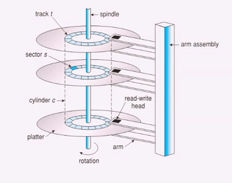

# Mass-Storage Systems

Attualmente abbiamo hard disk drives (HDD) e nonvolatile memory (NVM).

I bit spesso sono in parallelo su più dischi. Una traccia è composta da numerosi settori che contengono un tot di bit. Una volta i bit a raggio differenti erano diversi, mettendo lo stesso numero di bit, oggigiorno invece hanno la medesima dimensione. Inoltre gran parte delle operazioni viene fatta dall'HDD stesso.

Per misurare la performance abbiamo i seguenti parametri:

- Transfer Rate
- Effective Transfer rate
- Tempo di seek: movimento della testina
- Latenza di rotazione: quanto tempo ci mette per ritornare sul dato che vogliamo leggere? Espressa in giri al minuto
- La latenza media è la metà

Latenza di Accesso = Tempo medio di accesso = average seek time + average latency

Il tempo di I/O è quindi = average access time + (quantità da trasferire/transfer rate) + overhead controller.

In poche parole conviene sempre trasmettere KB per non rendere vano il tempo che si perde in latenza e seek.

I dischi non volatili sono chiamati Solid-state disks (SSDs) se hanno la forma di disco. Includono anche le USB drives. Può essere più affidabile di un hdd, ma sono più costosi e con un tempo di vita minore. solitamente hanno minore capacità, ma una velocità molto più alta. Non ci sono parti in movimento.

Il blocco in questo caso deve essere prima cancellato e poi scritto. Il numero di cancellazionei è però limitato. La vita è misurata in **drive writes per day (DWPD)**.

Il dispositivo è diviso in pagine con una tabella che permette di mappare indirizzi e pagine. Fa in modo che in quel disco un determinato indirizzo si vada ad allocarlo. L'obiettivo è bilanciare le riscritture.

Anche se sono delle sorte di RAM conviene sempre dividerle in pagine.

Spesso anche le stesse RAM vengono utilizzate come storage ad alta velocità per breve tempo.

I nastri magnetici sono ormai preistoria. Questi erano un tipo di memorizzazione sequenziale e venivano utilizzati per backup.

Solitamente i dischi sono collegati attraverso **I/O busses**.
Un disco è come un vettore di blocchi logici, è il fattore che ha permesso di poter organizzare come meglio si ritiene all'interno del disco. Andando avanti con l'innovazione attualmente è presente un microcontrollore sul dispositivo che gestisce le richieste.

## Disk Scheduling

Il problema dal punto di vista del sistema operativo è l'utilizzo delle risorse hardware in modo efficiente. Minimizzando seek time, minimizzare gli spostamenti della testina.

Il disco di I/O riceve tante richieste da OS, processi del sistema e dell'utente.

### FCFS

First-Come-First-Served

### SCAN

Il disco parte da una parte e arriva in fondo tornando indietro. E' detto anche algoritmo dell'ascensore.

### C-SCAN

Solo in salita, poichè è più facile usare una meccanica che non ha un cambio di direzione.

### SSTF

Si cerca quello più vicino.

### NVM

In questi casi non siamo in schemi in cui è necessario lo scheduling. Si può cercare di ottimizzare il lavoro andando a raggruppare le write su uno stesso blocco.

## Error Detection and Correction

Quando si rompono o quando ci sono errori come posso comportarmi?

- Error Detection: informazione ridondante (tipo bit di parità) con checksum e CRC.
- L'error correction code (ECC) permette anche di correggere alcuni errori.

Il disco dovrà avere delle strutture dati per poter gestire la struttura sul disco.

Un disco viene diviso in partizioni, viene identificata una partizione di root che contiene un sistema operativo. Nell'operazione di mount viene verificata la consistenza dei metadati. La partizione di root avrà un piccolo blocco chiamato **boot block** che permette di caricare il kernel dal file system: questo contiene il boot code e l'elenco delle partizioni.

Un altro pezzo del disco è costituito dallo swap space, dal backing store: sarebbe meglio avere un disco dedicato per non avere interferenze da altri I/O.

## Storage Attachment

I computer possono accedere allo storage attraverso:

- host-attached
- network-attachment: in mezzo c'è la rete, ma si "mimetizzano" con gli host-attached
- cloud: in mezzo vi è la rete, ma i tempi sono più lunghi e le prestazioni non sono garantite.

## Storage Array

Un "vettore" di dischi che possono lavorare insieme connessi in modo efficace. Il **RAID** permette di avere dei vantaggi.

### Struttura RAID

Un disco RAID (Reduntant Array of Inexpensive Disks) è un sistema che permette di fornire affidabilità attraverso la ridondanza.

Tempistiche:

- Tempo medio di riparare il disco
- Tempo medio di perdita dei dati (rottura doppio disco).

I RAID utilizzano anche lo **striping** andando a distribuire le informazioni in striscioline.

Mirroring e Shadowing.
