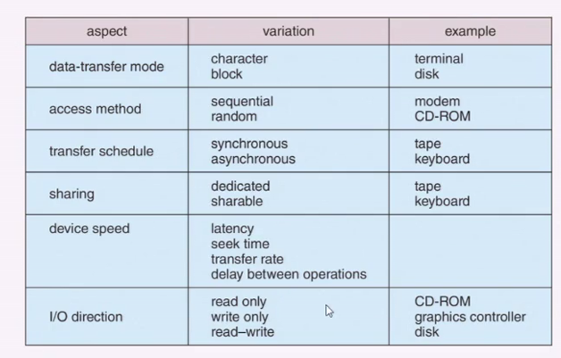

# I/O Systems

I/O è eterogeneo rispetto agli argomenti che abbiamo visto finora.

## Hardware

Possiamo classificarli in alcune categorie:

- Storage
- Transmissione
- Interfaccia Uomo-Macchina

I concetti comuni per lo scambio di segnali tra dispositivi di I/O e il computer abbiamo:

- Porte: punti di connessione per i dispositivi
- Bus: daisy chain o direct access
  - PCI bus in comune in PC e Server (PCIe). Molto performanti
  - Expansion Bus vengono usati per trasmissioni lente.
- Controller (host adapter): elettronica che opera come porta, bus, device.

Internamente contengono dei registri che permettono di contenere dei dati, dei registri che permettono di controllare e comandare. L'interazione si ha quindi con lettura e scrittura di questi registri.

SI può accedere ai device attraverso:

- Istruzioni I/O dirette
- Memory-mapped I/O: memoria device mappata nello pazio di indirizzamento del processore.

## Polling

Per ogni byte di I/O:

- Leggo il busy bit dal registro di stato finchè è 0.
- Si scrive sul registro di controllo se vogliamo fare read e write (in questo caso copiamo il dato)
- L'host setta il command-ready bit
- Il controller setta il busy bit e esegue il trasferimento.
- Il controller pulisce il busy bit, il bit di errore e il command-ready bit quando è concluso.

Il busy bit diventa però inefficiente se il dispositivo e lento, occupando CPU. Può essere critico. RIschio di perdere la reazione immediata.

## Interrupt

Sono la sveglia che ci permette di avviare l'operazione.

### Interrupt Driven I/O Cycle

Il device driver (funzione chiamata da chi vuole fare l'I/O, prendi questi dati e li mandi al dispositivo) inizializza l'I/O al posto di fare busy waiting. L'I/O controller inizializza. Mentre la CPU aspetta qualcun'altro potrà svolgere altre istruzioni. L'interrupt handler è il pezzo di codice che dovrà svolgere il lavoro una volta che si riceve il completamento dell'I/O. La CPU a quel punto ritorna ad operare sul task che aveva sospeso.

Gli interrupt vengono usati anche dalle eccezioni.

L'interrupt deve essere molto veloce poichè altrimenti si potrebbero avere riduzione delle prestazioni dovute al gran numero di interrupt

## DMA

L'interrupt handler deve essere veloce. DMA è un dispositivo che si sostitutisce alla CPU per spostare da memoria centrale a dispositivo per evitare programmed I/O su grandi quantità di dati. Il transito con I/O programmato fa passare tutto attraverso registri CPU (doppi accessi). La DMA bypassa la CPU. Un tempo era un dispositivo, ma ad oggi si tende a mettere il DMA nel dispositivo. La CPU vedrà pochi cicli rubati da DMA sul bus (cycle stealing). Non avrà un uso pieno del bus, ma potrà ancora utilizzabile.

## Application I/O Interface

I dispositivi possono essere adatti a una serie di esigenze.

A seconda del sistema operativo ci fornisce delle operazioni per poter agire con letture e scritture su dispositivi. I dispositivi sono visti ad esempio come file in Linux

I dispositivi a blocchi sono gli hard disk a cui è possibile accedere con lettura, scrittura o seek.

In dispositivi di rete abbiamo i socket.

Il timer può essere considerato come dispositivo e può essere impostato con interrupt.

## Non Blocking and Asynchronous

- Blocking (quasi sinonimo di sincrono). Blocco finchè non è finito.
- Non bloccanti: I/O call ritorna appena disponibile. Non aspetto, ma accetto il rischio che non venga effettuata subito. Ciò che sto per fare non deve essere determinante da quello che devo fare subito dopo. 
- Asincrono. Non bloccante, ma c'è la possibilità di risincronizzarsi in caso di necessità in cui il sistema ne avrà bisogno.

## Vectored I/O

Vettore di richieste

## Kernel I/O Subsystem

- Scheduling: non servirle subito, ma prova a gestirle in modo migliore, non sequenziale.
- Buffering: Realizzazione di struttura dati dove posizionare i dati dopo consumare o produrre in modo indipendente.
- Caching: Memorie per velocizzare
- Spooling: una specie di caching utilizzato da stampanti
- Device Reservation: Accesso esclusivo a device.

## Error Handling

## Strutture Kernel

Servono strutture per poter gestire gli interrupt utente.

## STREAMS

Si può organizzare il software attraverso più stadi. Dove ognuno fa un pezzo di lavoro parziale.