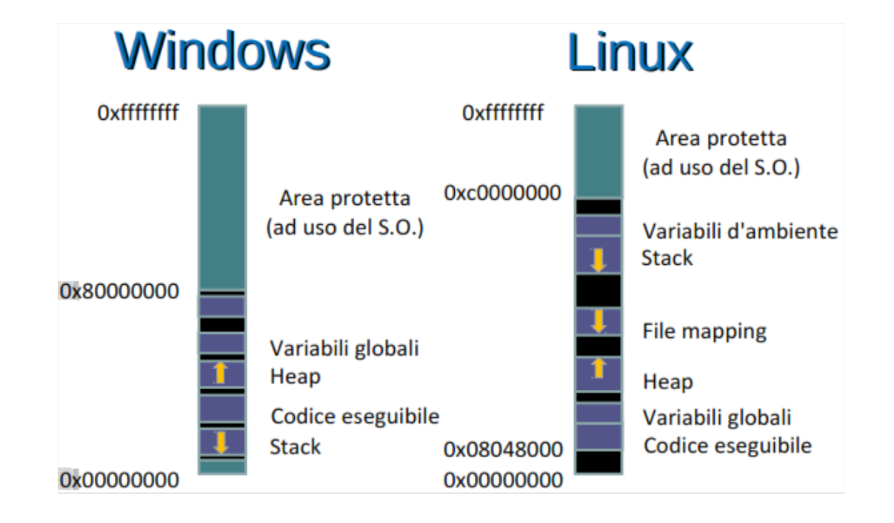

# Allocazione della memoria

- [Allocazione della memoria](#Allocazione-della-memoria)
  - [Organizzazione memoria Linux e Windows](#Organizzazione-memoria-Linux-e-Windows)
  - [Variabili](#Variabili)
  - [Ambiguità dei puntatori](#Ambiguit%C3%A0-dei-puntatori)
    - [Dangling Pointer](#Dangling-Pointer)
    - [Memory Leakage](#Memory-Leakage)
    - [Wild Pointer](#Wild-Pointer)

## Organizzazione memoria Linux e Windows

## Variabili

Le variabili globali hanno un indirizzo fisso determinato dal compilatore e dal linker.

Le variabili locali hanno invece un indirizzo relativo alla cima dello stack.

Le variabili dinamiche hanno un indirizzo assoluto determinato in fase di esecuzione e sono memorizzate nello heap.

## Ambiguità dei puntatori

Dato un puntatore non è possibile andarne a definire con certezza la dimensione del blocco puntato, fino a quando sarà garantito l'accesso, Se è possibile modificarlo, se occorre rilasciarlo: tutte queste lo rendono ambiguo e possono portare il programmatore a fare errori grossolani che possono portare a memory leakage, dangling pointer e wild pointer.

C++ Propone soluzioni con la standar library.

### Dangling Pointer

Puntatore che punta ad uno spazio di memoria che viene liberato. Non si può predire a che punto di memoria andrà a puntare. Conviene reinizializzarlo con NULL.

### Memory Leakage

Memoria dinamica allocata attraverso malloc o new e non liberata alla fine del processo.

### Wild Pointer

Puntatore dichiarato, ma non inizializzato.