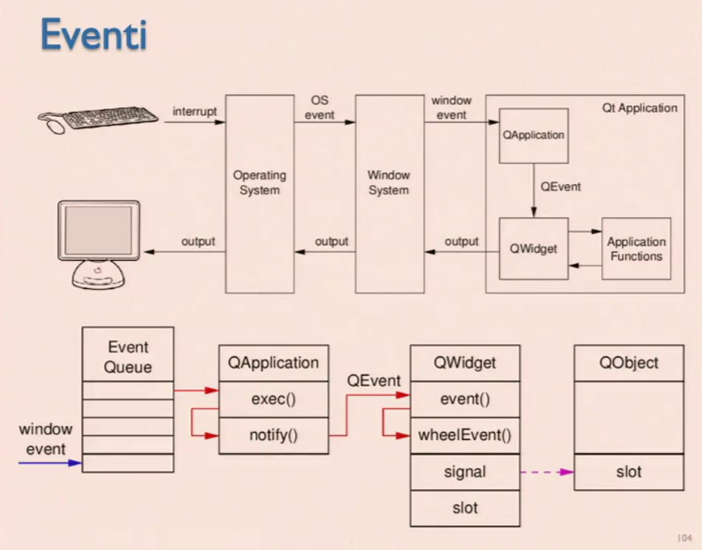

# Intefacce Grafiche

La User experience è molto importante. Ogni prodotto è frutto di come il gruppo di programmatori ha interagito e ha deciso di fare il prodotto. Il fatto che questi prodotti abbiano successo o meno è molto influenzata dall'utilizzabilità e la versabilità.

Anche il software è un prodotto, ma la natura astratta delle azioni che supporta rende spesso l'interazione con lo stesso uno degli aspetti fondamentali. Occorre perciò acquisire le capacità di progettare tale interazione in modo che risulti al tempo stesso efficace (le giuste cose), efficiente (le cose giuste) e facile da imparare, ma soprattutto piacevole.

Tradizionalmente l'interazione è legata a **WIMP** (Windows, Icons, Menus, Pointer).

Il programmatore deve calarsi nei panni dell'utilizzatore imparando a guardare le cose dal loro punti di vista. Il progettista non è l'utente tipico.

Le interfacce grafiche sono il primo impatto con il cliente che può portare a un pregiudizio.

Le interfacce devono essere comprensibili. Deve presentare delle affordance, ovvero uno strumento naturale su come possa essere possibile agire con esso. L'utente deve rendersi conto che qualcosa può essere cliccato, scritto, inviato.

Serve **coerenza** tra i suggerimenti visuali e le funzionalità reali, altrimenti pulìò generare frustrazione o attrito nel cliente.

La progettazione visiva deve fare in modo che l'utente sia interessato all'interfaccia e quindi a quello che vi è dentro. Deve essere **Plesurable**, **Meaningful** e **Usable**.

I componenti grafici sono i **widget** che ci permettono di renderizzare le interfacce grafiche elementari. I widget vivono molto bene in simbiosi con le classi.

Di base esistono tre gerarchie:

- Composite: modellata ad alberi (rettangoli dentro rettangoli)
- Template: Passi intermedi
- Strategy: Ci sono delle parti che possono essere complesse e variabili, facciamolo fare a un layout manager all'esterno.

Il main inizializza tutto e infine riceve messaggi per poter operare (programmazione reattiva).

## Pattern Composite

Strutture ricorsive ad albero per realizzare la relazione "parte-tutto". Il component è la classe più astratta che può avere implementazioni foglia o ulteriori zone (pannelli della nostra interfaccia).

## Pattern Template

Definisce la struttura generale di un algoritmo demandando alcune operazioni alle sotto-classi. Queste possono adattare il proprio comportamento senza compromettere la struttura dell'algoritmo. Le classi che ereditano possono fare Override.

## Pattern Strategy

I widget demandano ad un oggetto esterno il compito di gestire funzionalità specifiche come la disposizione.

La struttura di un programma basato su interfaccia grafica è radicalmente diversa rispetto a quella di un programma a caratteri. Il programma si appoggia ad una coda di eventi. Solitamente è l'OS che inserisce in coda. L'applicazione estrae e agisce.

Le callback vengono però usate in modo sincrono. Ogni componente deve andare a manifestare l'interessa agli eventi andando a implementare la callback.

**Architettura applicativa slide 27**

- Inizializza FW
- Crea albero widget
- Registra callback
- Esegue ciclo eventi

## Gestire eventi

La relazione tra evento e callback è dinamica. Ogni framework ha un suo modo per inserire nuovi eventi nella coda. Gli algoritmi di posizionamento e visualizzazione sono inizializzati in maniera lazy poichè sono onerosi.

La maggior parte dei messaggi sono già elaborati dai widget.

Per fare in modo che la procedura dell'evento sia troppo lunga possiamo attivare un thread (no visual tree) oppure in piccoli pezzettini.

**SOLO IL THREAD PRINCIPALE TOCCA IL VISUAL TREE**

E' prassi comune mantenere una struttura dati condivisa a cui collettivamente accedono le diverse call-back all'interno della quale sono memorizzate le informazioni raccolte dell'utente o calcolate dallo strato applicativo => **MODELLO**.

Conserva lo stato dell'applicazione.

L'albero di widget che rispecchia la situazione del modello prende il nome di **vista**. L'insieme delle callback agisce da mediatore tra vista e modello prendendo il nome di **Controllore**.

Questi tre componenti compone il paradigma MVC.

- Modello
  - Gestisce stato e dati
  - Non conosce la vista
  - Si appogge a strato di persistenza
  - Può essere riutilizzato per interfacce differenti
- Vista
  - Presentazione grafica modello
  - offre meccanismi all'utente per modellare i dati
  - Si aggiorna al cambiare del modello
  - Non memorizza dati
- Controllore
  - Intermediario
  - Traduce interazioni in richieste al modello
  - Determina quale vista deve essere presentata

Per facilitare questo compito si usa il **pattern Observer**.

Ciò che può cambiare è il **Subject** che incorpora oggetti interessati che implementano Subject che possono dire "dato aggiornato". Le viste si iscrivono ai subject.

L'iscrizione viene fatta ad un adapter che permette di filtrare solo le viste utili.

# Libreria QT

Framework multipiattaforma generale.

Scriviamo in linguaggio C++ con alcune macro poichè il meta-object compiler va a creare altro codice che permette di far funzionare il tutto.
Binding con molti linguaggi.

E' suddiviso in moduli:

- Essential: componenti base.
- Add-Ons

Estende c++ aggiungendo un sacco di funzionalità.

- Meccanismo di comunicazione con segnali e slot
- Meccanismo di proprietà
- Eventi e filtri
- Internazionalizzazione stringhe
- Timer a intervalli
- Organizzazione oggetti ad albero (no Composite).
- Puntori gestiti (QPointer): puntatore automaticamente messo a null quando liberato
- Dynamic Cast

## `QObject`

E' il cuore del modello a oggetti QT.
Da essi derivano la maggior parte delle classi del framework.
Ha tre responsabilità fondamentali:

- Gestione Memoria
- Introspezione (identificazione del tipo a runtime)
- Gestione degli eventi

Non usa Garbage collector, ma li gestisce in modo intelligente.

Ogni QObject può avere all'interno una serie di figli. Possono essere passati come parametri del costruttore il puntatore al genitore oppure tramite il `set_parent`.

Tutti vivono su heap, non ci dobbiamo preoccupare se non su quello radice. Sanno in quale thread è stato chiamato. L'albero deve essere usato solo da un thread. Si possono anche spostare `moveToThread()`.

La classe `QWidget` estende la semantica della relazione genitore figlio facendo in modo che possa essere contenuto nella sua view.

Per identificare i figli è utile andare a utilizzare un nome.

`QPointer` è il puntatore di QT che, una volta eliminato lo rende NULL. (Internamente weak::pointer).
`QSharedPointer`
`QVariant`

Ci sono le collezioni di dati che sono state implementate e che sono il duale di quelli presenti in C++. Possono essere manipolati con iteratori. Un tipo è simile a quello standard, ma c'è anche quello in stile JAVA ovvero con `it.hasNext()`.

Con quello C++ non possiamo modificare direttamente, in Java sì.

## `QWidget`

Ogni QWidget può stare sullo schermo e occupa un'area rettangolare. Possono anche essere nella stessa zona (X-Order).


Prima di poter usare i widget noi dobbiamo creare una `QApplication`.

Contiene il metodo `exec()` che non ritorna finchè non si conclude il programma. QUesto deve essere invocato per poter avviare il disegno.

Ogni oggetto `QWidget` può contenere figli e la classe `QLayout` permette di gestire la sua disposizione du schermo.

## `QLayout`

`QHBoxLayout` / `QVBoxLayout`

`QFormLayout`: 1/3

`QGridLayout`: 

`QStackedLayout`: 


## `QAbstractButton`

.pressed(), .released()

## Model View Framework

In Qt è presente un componente chiamato delegate che ha una relazione bidirezionale con la vista e il modello. (visualizzazione e modifica dati)

## Meta-Object System

La parte principale di QT è il MOC, un sistema di meta informazioni per classi e tipi che permette l'estensione di C++.

- Signal e Slot per comunicazione tra oggetti
- Proprietà dinamiche
- Cast typesafe RTTI
- Serializzazione e deserializzazione di tipi arbitrari.

Si basa su 3 componenti:

- La classe `QObject` da cui derivano tutti gli oggetti che fanno uso del Meta-Object Compiler
- La macro `Q_OBJECT` che deve essere messa all'inizio della classe nella parte privata. QUesto permette al MOC di capire che è una classe che eredita da QObject e esegue:
  - Type Introspection: esaminazione tipo, proprietà e metodi in esecuzione
  - reflection: permette a un oggetto di modificare la propria struttura e il proprio comportamento a runtime.
- MOC fornisce a tutte le sottoclassi di Qobject tutto il codice necessario per implementare le funzionalità.

MOC va a generare classi aggiuntive con estensione `.moc`. Va a riconoscere le zone `public slot:` e `signal:`.

La zona `public slot` può è la zona che contiene metodi che possono essere destinatari di messaggi, mentre la `signal` è la zona che contiene metodi senza corpo che servono come emettitori di messaggi.

## Gestire l'interazione

Modello di esempio:

```c++
class Model: public QObject {
    Q_OBJECT
    int count, min, max;
public:
    Model(int v, int min = 0; int max = 100):
    count(v), min(min), max(max){}

public slots:
    void countUp(){
        if (count < max){
            count++;
            emit changed(count);
        }
    }
    void countDown(){
        if (count > min){
            count--;
            emit changed(count);
        }
    }

signals:
    void changed(int newValue);
}
```

La funzione `connect` è una funzione di QT che si occupa di andare a collegare un signal di un `QObject` allo slot di un altro. COllegamento dinamico a RUntime.

```c++
void main(int argc, char* argv){
    QApplication app(argc, argv);

    QPushButton *b = new QPushButton("+");
    Model *m = new Model(0,0,100);
    QLabel *l = new QLabel("0");

    QObject::connect(b, &QPushButton::clicked,
                    model, &Model::countUp);

    QObject::connect(model, &Model::changed,
            [=](int v){
                l->setText(QString::number(v))
            });
    b->show();
    app.exec();
}
```

Nel nostro file dobbiamo aggiungere `#include "main.moc"`, altrimenti il codice generato non viene visto.

Signal e slot offrono un'implementazione dinamica del pattern observer facendo uso di callback type-safe. la comunicazione può essere molti a molti, può avvenire tra thread diversi e può essere stabilita o eliminata in esecuzione.

- Un SIGNAL può essere connesso a più SLOT
- Più SIGNAL possono essere connessi a uno stesso SLOT
- Un SIGNAL può essere connesso ad un altro SIGNAL
- Una connessione può essere rimossa con disconnect.

## Eventi

Noi non andiamo a inserire alcun corpo per la `signal`. La signal è sincrona che gira per tutti gli slot che sono connessi alla signal. I due devono essere conformi nei parametri, la firma deve essere uguale.

Se due Oggetti hanno affinità di thread diversi non possono stare nella stessa view.

Con la connect non abbiamo bisogno di affinità tra i thread. La connect non farà una chiamata diretta, ma posso consegnarglielo in modo asincrono, iniettandolo nella coda dei suoi messaggi.

Anche con la stessa affinità è possibile andare a contrassegnare la chiamata a thread affini in maniera asincrona. Magari in situazione in cui abbiamo un priorità più bassa.

Gli eventi vengono racchiusi in `QEvent`. Possono rappresentare cambiamenti avvenuti all'interno dell'applicazione o da attività esterne che interessano l'applicazione.

Eventi di Input. Eventi di Timer. Eventi di Paint ridisegno.

Come vengono consegnati? Generalmente vengono emessi dal sistema operativo (flag spontaneous a true), ma possono essere anche emessi in maniera manuale attraverso `sendEvent`(sincrono) e `postEvent`.

Questi eventi sono mirati ad un oggetto che implementa il metodo `event()` che permette di gestirlo.

Arrivano attraverso la classe `QCoreApplication` che fornisce la coda di messaggi e controlla il loop degli eventi e inoltra tutti gli eventi. Preleva dalla coda, li traduce e li consegna chiamando il metodo `event()` degli oggetti a cui si riferisce.

Il loop degli eventi inizia con la chiamata a `exec()`. Terminerà solo con la chiamata di `quit()`.

Per operazioni lunghe viene usato `processEvent()`.

Il metodo `event()` non gestisce proprio l'evento, ma chiama un metodo che lo gestisce in modo specifico.

L'evento HW viene consegnato alla `QApplication` andandolo a prelevare dalla eventQueue. La exec la manda alla notify che va ad invocare l'evento dell'Object, decide a che evento delegarlo e manda un segnale.



Il giro lo fa anche il ridisegno che riemerge dall'applicazione e ridisegna tutto.

### Eventi Ridisegno

Oggetto `QPaintEvent` viene consegnato al widget ogni volta che il sistema reputa sia necessario un aggiornamento del widget. Il metodo `paintEvent` ha il compito di gestire l'evento.

### Eventi periodici

Ogni `QObject` possiamo andare a settare un `startTimer()` che ritorna un timer id che lancia un `QTimerEvent` ogni X secondi fino alla chiamata di `killTimer(id)` L'evento viene gestito da `timerEvent` che prende come parametro `QTimerEvent`.

Più conveniente è l'utilizzo di `Qtimer` per eventi periodici o single-shot. Viene avviato con `start()` e invoca `timeout()` quando triggerato.

## Qt Build System

Il sistema di build di Qt mette a disposizione 3 strumenti fondamentali:

- MOC (Meta Object Compiler): genera il codice C++ necessario per utilizzare `QObject` e le sue sottoclassi rendendo disponibili le funzionalità dei meta-object. (signal e slot).
- UIC (User Interface Compiler): traduce la definizione xml dell'interfaccia in XML della user interface `.ui` in header C++.
- RCC (Resouce Compiler): genera codice C++ per incorporare risorse binarie nelle applicazioni Qt.

Di base si parte dai file sorgenti che vengono compilati in oggetti `.o`. A partire dai `.h` si parte con `moc`. Negli header possiamo andare a creare la ui attraverso ui.

`QSettings` possiamo andare a salvare le impostazioni all'interno della nostra applicazione

Possiamo usare anche `QThread` e `QtConcurrent`